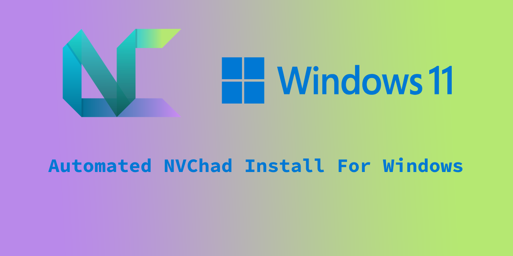
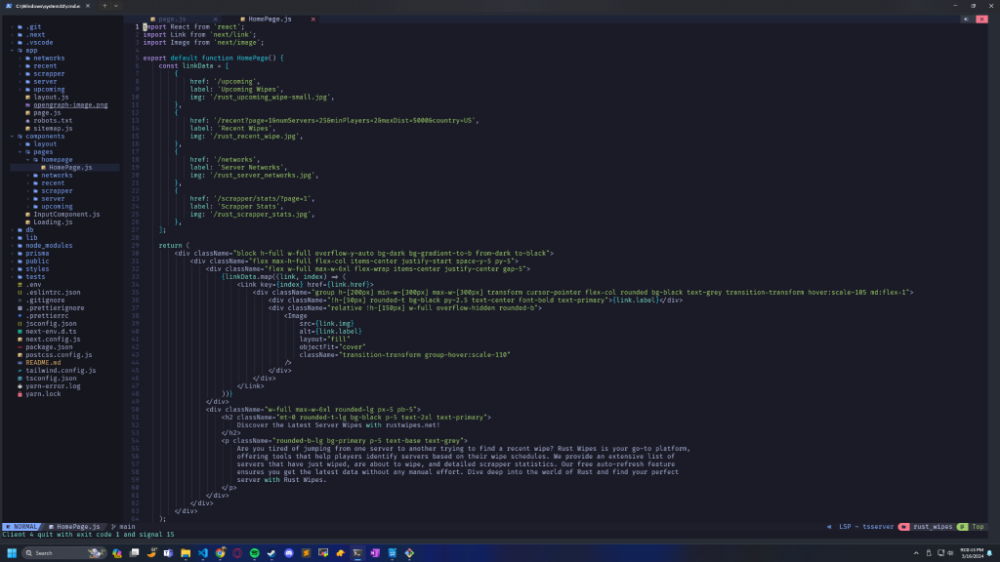

# NVChad Windows Installer

A Node.js script to automate the setup of NVChad (Neovim config) on Windows 10 and Windows 11.

## Features

-   Installs NeoVim with the latest version
-   Installs msys2 for C++ support
-   Sets up the JetBrains Mono Nerd Font for enhanced typography
-   Clones and configures the NVChad repository
-   Installs and configures Language Server Protocols (LSPs) for Python and TypeScript/JavaScript

## Prerequisites

Before running the setup script, ensure that your system meets the following requirements:

-   Windows 10 or Windows 11
-   Node.js (version 14.0.0 or higher)
-   npm (version 6.0.0 or higher)
-   Git (version 2.0.0 or higher)

## Setup Script Steps

-   Check for the required prerequisites
-   Install NeoVim
-   Install msys2 for C++ support
-   Set up the JetBrains Mono Nerd Font
-   Clone and configure the NVChad repository
-   Install and configure LSPs for Python and TypeScript/JavaScript

## Script Usage

1. Open Windows Terminal in the directory you want to save the installer
2. Clone this repository to your local machine:
   `git clone https://github.com/tsmith165/nvchad-windows-installer.git`

3. Navigate to the cloned directory:
   `cd nvchad-windows-installer`

4. Run the setup script:
   `node setup.js`

5. Once the setup.js script is successfully completed, close all instances of Windows Terminal
6. Open Windows Terminal at the directory you want to edit

7. Launch NeoVim with NVChad by running:
   `nvim`

## Customization

If you want to customize the NVChad configuration, you can modify the following files:

-   `chadrc.lua`: The main configuration file for NVChad.
-   `plugins.lua`: Configuration file for plugins.
-   `lspconfig.lua`: Configuration file for Language Server Protocols.

## Troubleshooting

If you encounter any issues during the setup process, please check the `debug.log` file for detailed logs and error messages.

## License

This project is licensed under the [MIT License](LICENSE).
